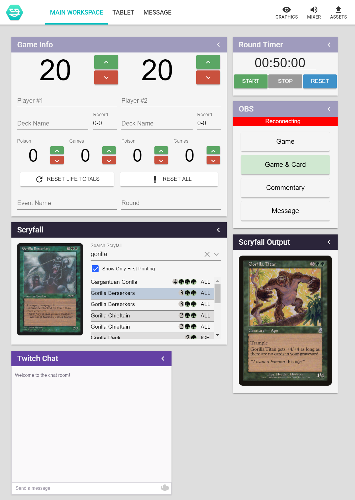

# streamsgood-mtg

```sh
git clone --recurse-submodules https://github.com/StreamsGood/streamsgood-mtg %nodecg%/bundles
cd %nodecg%/bundles
node install_all.js
```

NodeCG bundles for streaming Magic.

_Note: NodeCG will scream at you because you now have a .git directory in your bundles._

Includes some garbage that I need to eliminate, like a 20 minute OBS panel that has my testing obs-websocket credentials in it. I'll get around to cleaning it up eventually, but this could be a good reference if you're looking for ideas.

* See [StreamsGood/nodecg-twitch-chat](https://github.com/StreamsGood/nodecg-twitch-chat) for configuring the Twitch chat iframe.


